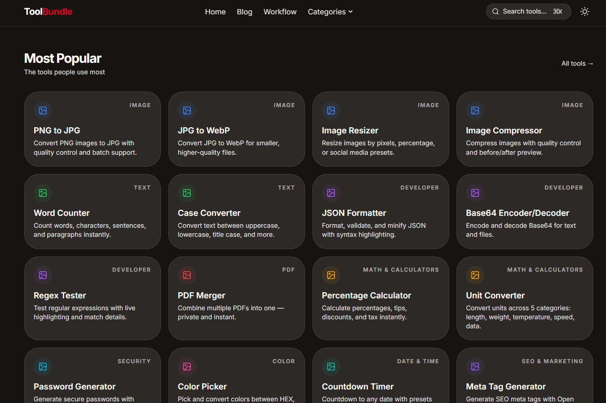
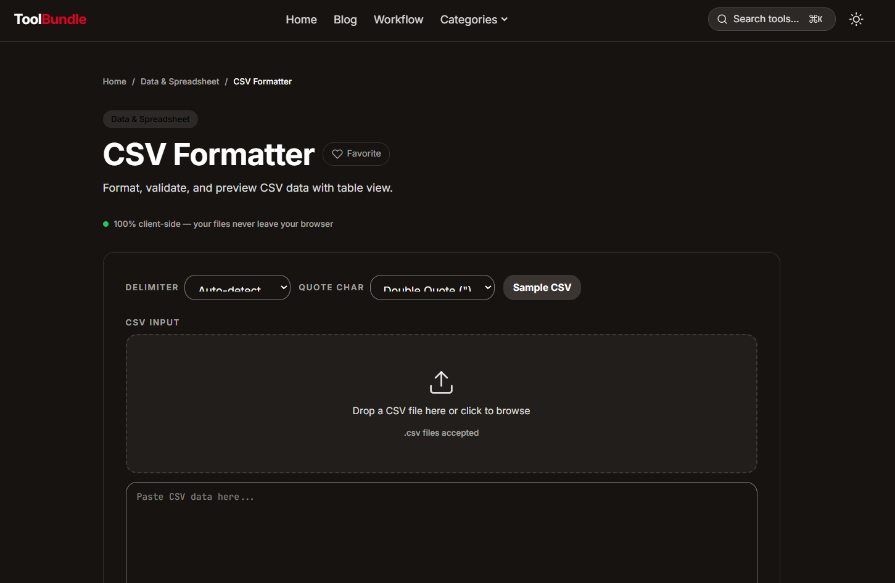
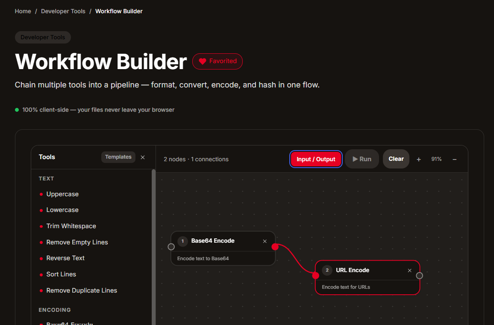

# ToolBundle

> Every tool you need. Zero uploads. 100% client-side.

A collection of free, privacy-first browser tools for images, text, PDFs, math, developer utilities, and security. Every tool runs entirely in your browser — no file uploads, no accounts, no limits.



## Features

- **100% Client-Side** — Your files never leave your browser. All processing happens locally using JavaScript and Canvas API.
- **Privacy First** — No server uploads, no data collection, no cookies. What you process stays on your device.
- **Instant Results** — No upload waits, no queues. Results appear instantly because everything runs on your machine.
- **Free Forever** — No accounts, no subscriptions, no paywalls. Every tool is free for everyone.
- **123 Tools** — Across 16 categories: Image, Text, Developer, PDF, Math, Security, Color, Date & Time, SEO, Data, Fun & Utility, Education, Finance, Health, Video & Audio, and **AI Tools**.
- **Dark UI** — Clean dark canvas with electric yellow accent. Built with a consistent design system.
- **New: Workflow Builder** — Build and automate your workflows with a visual drag-and-drop interface.


## Tech Stack

| Layer | Technology |
|---|---|
| Framework | [Astro 5](https://astro.build/) |
| UI Components | [Preact](https://preactjs.com/) (~3KB) |
| Styling | [Tailwind CSS 4](https://tailwindcss.com/) |
| Language | TypeScript |
| Hosting | Static (Cloudflare) |

## Getting Started

```bash
git clone https://github.com/your-username/toolbundle.git
cd toolbundle
npm install
npm run dev
```

Open [http://localhost:4321](http://localhost:4321) in your browser.

## Documentation

Full documentation is available in the [`docs/`](./docs/) directory:

| Document | Description |
|---|---|
| [Getting Started](./docs/getting-started.md) | Installation, development, and deployment |
| [Tech Stack](./docs/tech-stack.md) | Technologies and architecture decisions |
| [Project Structure](./docs/project-structure.md) | Directory layout and file organization |
| [Adding New Tools](./docs/adding-tools.md) | Step-by-step guide to add a new tool |
| [Tools List](./docs/tools-list.md) | Complete list of all 32 tools |
| [Design System](./docs/design-system.md) | UI components, colors, typography |

## Available Tools

### Image Tools (13)
PNG to JPG, JPG to PNG, JPG to WebP, PNG to WebP, WebP to PNG, Image Resizer, Image Compressor, Image Cropper, Image to Base64, Image Rotator & Flipper, Image Watermark, Photo Filters, SVG Optimizer

### Text Tools (14)
Word Counter, Case Converter, Slug Generator, Text Reverser, Line Counter, Text Repeater, Remove Duplicate Lines, Text Sorter, Reading Time Calculator, Fancy Text Generator, Readability Score, Text to Hashtags, Emoji Picker, Text to Speech

### Developer Tools (26)
JSON Formatter, Base64 Encoder/Decoder, URL Encoder/Decoder, Hash Generator, Regex Tester, Lorem Ipsum Generator, Markdown to HTML, HTML to Markdown, CSS Formatter, YAML Formatter, HTML Formatter, SQL Formatter, XML Formatter, JavaScript Formatter, TypeScript to JS, Color System Generator, Regex Explainer, .gitignore Generator, JSON to TypeScript, JWT Decoder, UUID Generator, Text Diff, Box Shadow Generator, CSS Grid Generator, CSS Flexbox Generator, Border Radius Generator

### PDF Tools (5)
PDF Merger, PDF Splitter, PDF Compressor, PDF Rotator, PDF to Text

### Math & Calculators (5)
Percentage Calculator, Unit Converter, BMI Calculator, Loan Calculator, Age Calculator

### Security Tools (5)
Password Generator, Password Strength Checker, OTP Generator, QR Code Generator, Barcode Generator

### Color Tools (4)
Color Picker, Color Palette Generator, Contrast Checker WCAG, CSS Gradient Generator

### Date & Time Tools (4)
Countdown Timer, Timezone Converter, Date Difference Calculator, Unix Timestamp Converter

### SEO & Marketing (3)
Meta Tag Generator, Robots.txt Generator, Sitemap Generator

### Data & Spreadsheet (3)
CSV to JSON, JSON to CSV, CSV Formatter

### Fun & Utility (7)
Random Number Generator, Dice Roller, Coin Flipper, Random Name Picker, Wheel Spinner, Decision Maker, Placeholder Image Generator

### Education & Students (7)
Flashcard Maker, Quiz Maker, Grade Calculator, GPA Calculator, Citation Generator, Study Planner, Fraction Calculator

### Finance & Money (7)
Currency Converter, Compound Interest Calculator, Tax Calculator, Budget Tracker, Investment Calculator, Net Worth Calculator, Break Even Calculator

### Health & Medical (5)
Calorie Calculator, Water Intake Calculator, Sleep Cycle Calculator, Body Fat Calculator, Pregnancy Due Date Calculator

### Video & Audio (5)
Video to MP3, Audio Trimmer, Volume Booster, Audio Converter, Video Speed Changer

### AI Tools (10)
OCR — Image to Text, Background Remover, Text Summarizer, Object Detection, Grammar Checker, Image Captioning, Sentiment Analysis, Question Answering, AI Translator, Speech to Text

## License

MIT

---

Built with Astro + Preact + Tailwind CSS
